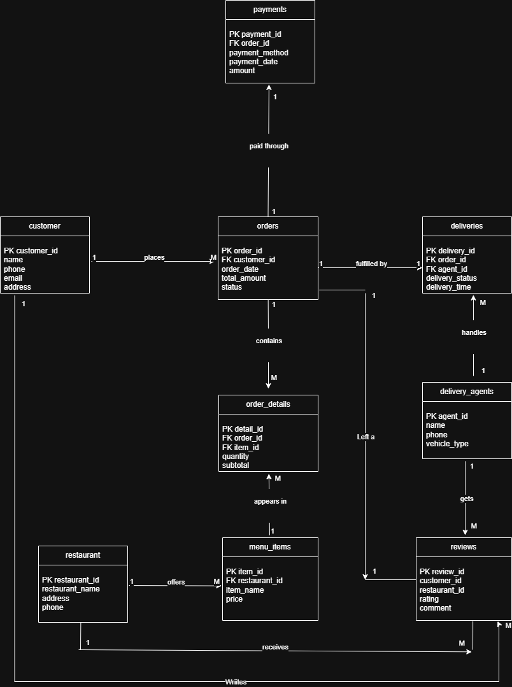
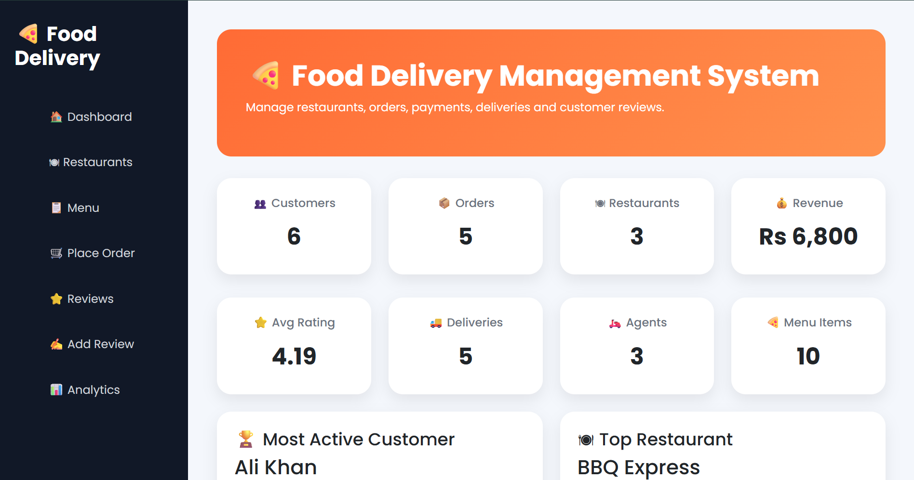
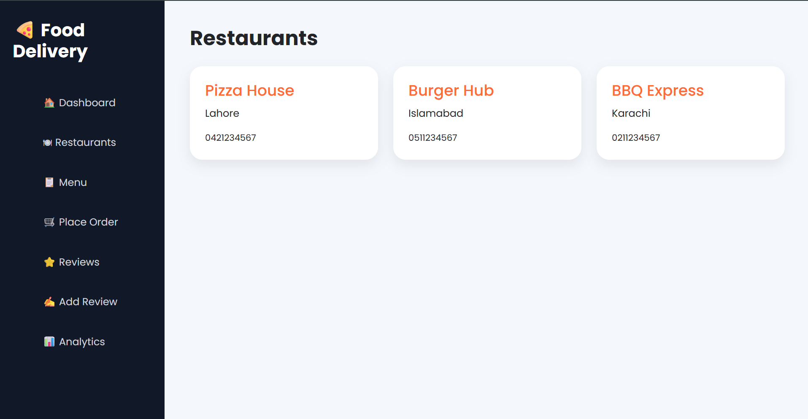
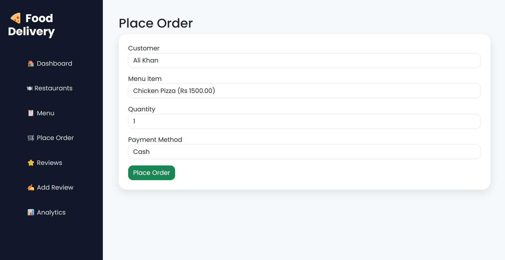
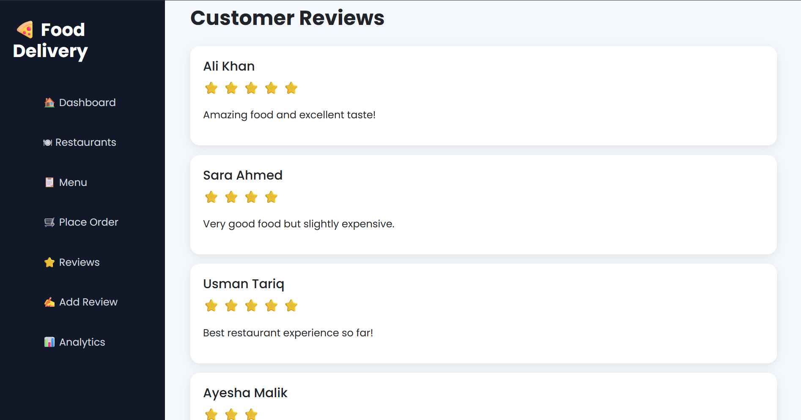
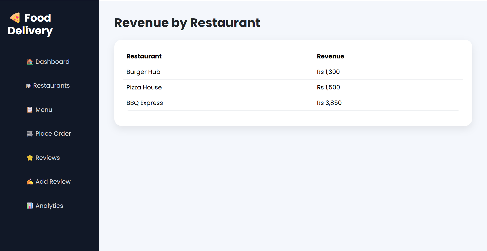

# 🍕 Food Delivery Management System

A full-stack Food Delivery Management System built using PostgreSQL, Flask, HTML, CSS, and Bootstrap.

The project models a real-world food delivery platform and demonstrates database design, normalization, SQL querying, and web application development.

---

## Features

### Database Design

- Customer Management
- Restaurant Management
- Menu Management
- Order Processing
- Payment Tracking
- Delivery Tracking
- Delivery Agent Management
- Review System

### Web Application

- Dashboard with business statistics
- Browse Restaurants
- Browse Menu Items
- Place Orders
- Add Reviews
- Revenue Analytics

---

## Database Schema

Entities:

- Customers
- Restaurants
- Menu Items
- Orders
- Order Details
- Payments
- Deliveries
- Delivery Agents
- Reviews

The database follows normalization principles and uses:

- Primary Keys
- Foreign Keys
- CHECK Constraints
- UNIQUE Constraints
- NOT NULL Constraints

---

## Review System

Customers can review:

- Restaurants
- Delivery Agents
- Orders

A CHECK constraint ensures that each review targets exactly one entity.

---

## Screenshots

### ER Diagram

### Dashboard

### Restaurants

### Place Order

### Reviews

### Analytics

---

## Technologies Used

- PostgreSQL
- Flask
- Python
- HTML
- CSS
- Bootstrap
- Draw.io

---

## Learning Outcomes

This project helped me practice:

- Database Design
- ER Modeling
- Database Normalization
- SQL Queries
- PostgreSQL
- Flask Development
- CRUD Operations
- Full-Stack Integration

---

## Future Improvements

- Authentication System
- Order Tracking History
- Restaurant Categories
- Charts and Data Visualization
- Admin Panel
- Customer Profiles

---

## Author

Developed as a personal project to strengthen DBMS, PostgreSQL, and Full-Stack Development skills.